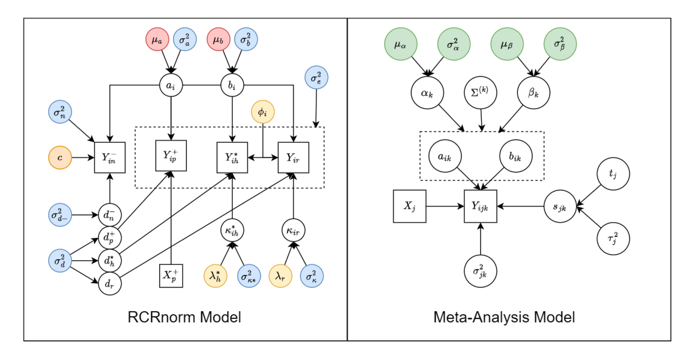

.. MetaNorm documentation master file, created by
   sphinx-quickstart on Wed Oct 25 22:42:44 2023.
   You can adapt this file completely to your liking, but it should at least
   contain the root `toctree` directive.

MetaNorm: Incorporating Meta-analytic Priors into Normalization of NanoString nCounter Data
================================================================================================

MetaNorm is a normalization procedure for Nanostring nCounter datasets. 

Here is a quick overview of the structure of the model:

For a more detailed exploration of our model, please refer to `our paper <https://doi.org/10.1101/2023.11.17.567577>`_:

Dependencies 
---------------------
Here we list the dependencies of the package. 

.. note:: 
   Other than R, there is no need for you to install those 
   packages manually as they will be installed while installing 
   MetaNorm
   

.. list-table:: Dependencies
   :widths: 50 50 
   :align: center
   :header-rows: 1

   * - Package
     - Version 
   * - R 
     - ``>=4.0.2``
   * - Rcpp
     - ``>=1.0.10``
   * - RcppArmadillo
     - ``>=0.12.4``
   * - mvtnorm
     - ``>=1.1``
   * - MASS
     - ``>=17.3``
   * - truncnorm
     - ``>=1.0``
   * - progress
     - ``>=1.2.2``

Installation
------------------
For the stable version: 

.. code:: bash 

  library(devtools)
  install_github("jbarth216/MetaNorm",subdir="MetaNorm", ref="main")

or if you want to try out the development version: 

.. code:: bash 

  install_github("Yuqiu-Yang/MetaNorm", subdir="MetaNorm", ref="main")

User Guide / Tutorial
==========================
This package contains two main projects: mete analysis and MetaNorm. 
They are described in detail below.

.. toctree::
   :maxdepth: 1
   :caption: Meta Analysis 

   meta 

.. toctree:: 
   :maxdepth: 1
   :caption: Normalization

   norm 

.. toctree::
  :maxdepth: 1
  :caption: Resources
  :hidden: 

  references
  Our Paper <https://doi.org/10.1101/2023.11.17.567577>
  Dr. Xinlei (Sherry) Wang <https://www.uta.edu/academics/faculty/profile?username=wangx9>
  Dr. Jackson Barth <https://statistics.artsandsciences.baylor.edu/person/dr-jackson-barth>
  Yuqiu Yang <https://github.com/Yuqiu-Yang>
  Dr. Guanghua (Andy) Xiao <https://qbrc.swmed.edu/labs/xiaolab/>
  GitHub <https://github.com/jbarth216/MetaNorm>
  SMU M3 high-performance computing (HPC) cluster <https://www.smu.edu/oit/services/m3>

Resources
===============

For our paper, read our preprint `here <https://doi.org/10.1101/2023.11.17.567577>`_.

For more resources, please visit the following:
   
   * `Dr. Xinlei (Sherry) Wang <https://www.uta.edu/academics/faculty/profile?username=wangx9>`_
   * `Dr. Jackson Barth faculty page <https://statistics.artsandsciences.baylor.edu/person/dr-jackson-barth>`_
   * `Yuqiu Yang <https://github.com/Yuqiu-Yang>`_
   * `Dr. Guanghua (Andy) Xiao <https://qbrc.swmed.edu/labs/xiaolab/>`_
   * `SMU M3 high-performance computing (HPC) cluster <https://www.smu.edu/oit/services/m3>`_

For project development and newest updates, consider visiting the following:

   * Our `Github <https://github.com/jbarth216/MetaNorm>`_

Indices and tables
=====================

* :ref:`genindex`
* :ref:`modindex`
* :ref:`search`
